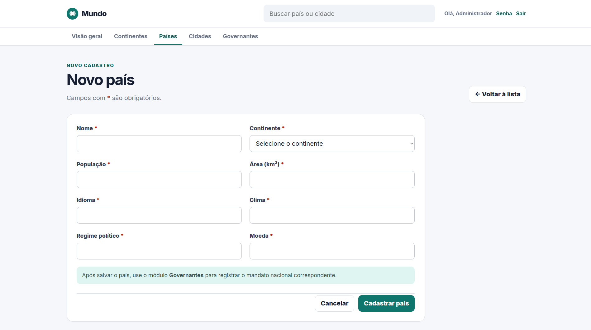
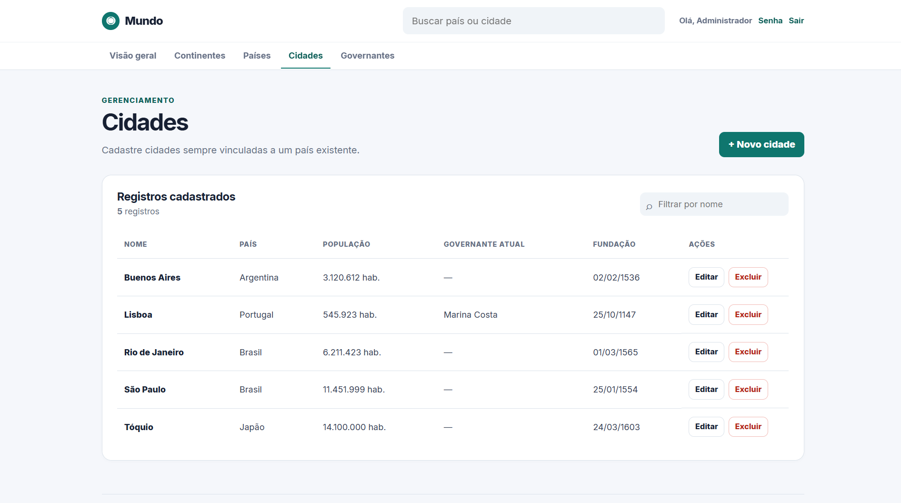

# G.I.S — Geografia Incremental Simples

## Sobre o projeto

**Aluno:** Kauan Christian Barbosa dos Santos

O **G.I.S — Geografia Incremental Simples** é uma aplicação web desenvolvida para o gerenciamento de informações geográficas do mundo.

O sistema permite cadastrar, consultar, editar e excluir informações relacionadas a **continentes, países, cidades e governantes**, mantendo os dados organizados em um banco de dados MySQL denominado `bd_mundo`.

O projeto foi desenvolvido com uma estrutura simples e organizada, separando a interface da aplicação, a lógica em PHP e os arquivos relacionados ao banco de dados. O usuário pode navegar pelas páginas do sistema, consultar registros, realizar buscas e gerenciar informações por meio de formulários.

## Funcionalidades

* Cadastro, consulta, edição e exclusão de continentes.
* Cadastro, consulta, edição e exclusão de países.
* Cadastro, consulta, edição e exclusão de cidades.
* Cadastro, consulta, edição e exclusão de governantes.
* Associação entre continentes, países, cidades e governantes.
* Pesquisa dinâmica de países e cidades pelo nome.
* Página inicial com estatísticas do banco de dados.
* Controle de acesso por tipo de usuário.
* Registro de eventos de autenticação no sistema.
* Validações para manter a integridade dos dados.
* Proteção contra exclusões que possam gerar registros órfãos.

## Interface do sistema

As imagens abaixo apresentam algumas das principais telas da aplicação.

### Tela inicial


### Tela de cadastro



### Tela de consulta



## Tecnologias utilizadas

* **HTML5** — estrutura das páginas.
* **CSS3** — estilização e responsividade da interface.
* **JavaScript** — validações, confirmações de exclusão e pesquisas dinâmicas.
* **PHP** — lógica da aplicação e comunicação com o banco de dados.
* **MySQL** — armazenamento e gerenciamento das informações.
* **PDO** — conexão e execução de consultas ao banco de dados.
* **Git** — controle de versão.
* **GitHub** — armazenamento e versionamento do projeto.

## Estrutura do projeto

A organização dos arquivos foi separada de acordo com suas responsabilidades:

```text
geografia-crud-mundo/
│
├── assets/
│   └── arquivos visuais e recursos da interface
│
├── backend/
│   ├── actions/
│   │   └── ações e operações do sistema
│   │
│   ├── config/
│   │   └── configurações e conexão com o banco
│   │
│   └── includes/
│       └── autenticação, validações e componentes reutilizáveis
│
├── database/
│   ├── bd_mundo1.sql
│   ├── dados_exemplo.sql
│   ├── usuarios_exemplo.sql
│   └── atualizar_senha_admin.sql
│
├── arquivos PHP da aplicação
│
├── .gitignore
└── README.md
```

A separação das pastas facilita a localização dos arquivos e contribui para a manutenção e compreensão do projeto.

## Requisitos

Para executar o sistema localmente, é necessário possuir:

* **XAMPP** ou outro servidor local compatível com PHP.
* **Apache**.
* **MySQL**.
* **PHP**.
* **Navegador web**.

O projeto foi desenvolvido para execução em ambiente local.

## Como executar

### 1. Baixar o projeto

Extraia ou clone o repositório dentro do diretório do servidor local.

No XAMPP, a pasta deve ficar em:

```text
C:\xampp\htdocs\geografia-crud-mundo
```

### 2. Iniciar o servidor

Abra o painel do XAMPP e inicie os serviços:

```text
Apache
MySQL
```

### 3. Criar o banco de dados

Acesse o phpMyAdmin pelo navegador:

```text
http://localhost/phpmyadmin
```

Importe o arquivo:

```text
database/bd_mundo1.sql
```

Esse script cria o banco de dados `bd_mundo`, suas tabelas, relacionamentos, restrições e estruturas necessárias para o funcionamento da aplicação.

### 4. Inserir dados de exemplo

Para executar o sistema com registros já cadastrados para testes, importe também:

```text
database/dados_exemplo.sql
```

### 5. Acessar a aplicação

Depois de iniciar o Apache e o MySQL, acesse:

```text
http://localhost/geografia-crud-mundo/
```

O arquivo `index.php` deve ser executado através do servidor Apache. Portanto, ele não deve ser aberto diretamente com duplo clique no computador.

## Autenticação

Atualmente, o sistema ainda não possui uma tela de cadastro de novos usuários. Por isso, o banco de dados disponibiliza contas de demonstração pré-definidas para permitir o acesso durante os testes e a apresentação do projeto.

As credenciais abaixo são **fictícias, exclusivamente para demonstração e de uso temporário**. Elas serão alteradas posteriormente antes de uma utilização definitiva do sistema.

| Usuário        | Senha inicial   | Tipo          |
| -------------- | --------------- | ------------- |
| `admin`        | `SenhaInicial0` | Administrador |
| `ana.souza`    | `SenhaInicial1` | Usuário       |
| `bruno.lima`   | `SenhaInicial2` | Usuário       |
| `carla.mendes` | `SenhaInicial3` | Usuário       |

Todas as contas iniciam com `primeiro_acesso` ativo. Após o primeiro login, o usuário é direcionado obrigatoriamente para a alteração da senha.

A nova senha deve possuir:

* pelo menos 8 caracteres;
* uma letra maiúscula;
* uma letra minúscula;
* um número.

As novas senhas são armazenadas no banco de dados utilizando hash.

### Permissões

As contas possuem diferentes níveis de acesso:

**Administrador**

* Pode cadastrar registros.
* Pode editar registros.
* Pode excluir registros.
* Pode consultar as informações.

**Usuário**

* Pode consultar as informações.
* Não pode cadastrar, editar ou excluir registros.

Para adicionar as contas de demonstração a um banco que já tenha sido criado anteriormente, pode ser utilizado:

```text
database/usuarios_exemplo.sql
```

Para redefinir a senha inicial do administrador durante os testes, pode ser utilizado:

```text
database/atualizar_senha_admin.sql
```

O sistema também possui mecanismos de proteção contra tentativas consecutivas de acesso incorreto. Após três tentativas incorretas, a conta é bloqueada até que um administrador realize a liberação.

Os eventos relacionados a login, bloqueio, logout e alteração de senha são registrados na tabela `logs`.

## Segurança

A aplicação utiliza alguns mecanismos para aumentar a segurança e a integridade dos dados:

* Utilização de **PDO** para conexão com o banco.
* Consultas SQL preparadas.
* Validações realizadas no servidor.
* Proteção por **token CSRF** em formulários.
* Controle de acesso baseado no tipo de usuário.
* Armazenamento de senhas utilizando hash.
* Controle de tentativas de login.
* Registro de eventos na tabela de logs.
* Restrições e chaves estrangeiras no banco de dados.

As credenciais apresentadas neste README são contas de demonstração temporárias utilizadas exclusivamente porque o sistema ainda não possui cadastro de usuários. Elas deverão ser substituídas antes de uma utilização definitiva.

## Descrição detalhada

### Continentes

No módulo de continentes, é possível cadastrar informações como:

* nome;
* população;
* área em km²;
* quantidade de países.

A quantidade de países pode ser atualizada automaticamente pelo banco de dados por meio de gatilhos.

### Países

Cada país é associado a um continente existente.

O cadastro pode incluir:

* nome;
* população;
* área;
* idioma;
* clima;
* regime político;
* moeda.

### Cidades

Cada cidade é associada a um país.

O cadastro possui informações como:

* nome;
* população;
* área;
* clima;
* data de fundação.

### Governantes

O sistema permite cadastrar governantes associados a um país ou a uma cidade.

Entre as informações cadastradas estão:

* nome;
* partido político;
* data de nascimento;
* idade;
* data de início do mandato;
* data final do mandato.

### Dashboard e consultas

A página inicial apresenta informações estatísticas sobre os registros armazenados no sistema.

Entre os dados apresentados estão:

* quantidade de registros;
* cidades mais populosas;
* total de cidades por continente;
* cidade mais populosa de cada país.

A aplicação também possui uma pesquisa dinâmica para localizar países e cidades pelo nome.

### Integridade dos dados

As exclusões respeitam os relacionamentos definidos no banco de dados.

Por exemplo, um país que possua cidades vinculadas não pode ser excluído, assim como uma cidade ou país que possua um governante associado.

Esse controle evita a criação de registros órfãos e contribui para manter a consistência das informações armazenadas.

## Autor

**Kauan Christian Barbosa dos Santos**

Projeto desenvolvido para o curso de **Desenvolvimento de Sistemas — ETEC**.
